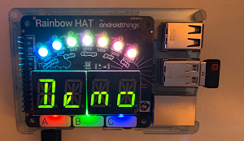

# HomeBear.Rainbow

 

> Windows 10 IoT Core UWP app that works great with the [Pimoroni RainbowHAT](https://shop.pimoroni.com/products/rainbow-hat-for-android-things). The app is currently work in progress.

## Prerequirements
- Windows 10
- Visual Studio 2019
- Raspbbery Pi 3 (B) with [Windows 10 IoT Core](https://developer.microsoft.com/en-us/windows/iot) 17763 or higher
- Enabled [Dynamic driver mode](https://docs.microsoft.com/en-us/windows/iot-core/develop-your-app/lightningproviders) in Windows 10 IoT Core
- Pimoroni [Rainbow HAT](https://shop.pimoroni.com/products/rainbow-hat-for-android-things)

## How it looks

At the moment, it's just a headless application that is controlled by the input controls of the RainbowHAT.



## Features

- [x] Control the large R, G, B LEDs
- [x] Listen to 'A', 'B', 'C' capacitive touch buttons
- [x] Piezo buzzer
- [x] APA102 to control seven multicolor LEDs
- [x] HT16K33 14-segment alphanumeric displays
- [x] BMP280 temperature sensor
- [x] BMP280 pressure sensor

**Keep in mind**
* All features have room for improvements.
* All values could be wrong. Please report mismatches measurements.

**Information**

Most of the logic behind is based on the offical Python libraries.

## Usage

Use the an instance of the `RainbowHAT` to controll the HAT, regardless what sub-controller (APA102, BMP280, HT16K33) you want to control.
Listen on events to get values back from the HAT.

Call the `PerformAction` method to execute specified actions on the Pi's HAT.

```
// Setup event callbacks.
rainbowHAT.CaptiveButtonPressed += CaptiveButtonPressed;
rainbowHAT.TemperatureMeasured += TemperaturMeassured;
rainbowHAT.PressureMeasured += PressureMeasured;

// Perform actions
rainbowHAT.PerformAction(RainbowHATAction.ShowDemo);
```

Keep an eye on the debug output. If something went wrong, it should be logged to it.

## Known issues

- Due to the narrowness of the temperature sensor the the Pi's CPU, it meassures more heat as actual value should be
- App gets randomly terminated.

## Ideas for the future

- Connect to Azure IoT Hub
- Rework as background process
- XAML UI to control the Rainbow HAT

## Publications
- Personal Blog: [[Raspberry Pi] Windows 10 IoT Core + Pimoroni Rainbow HAT = <3](https://tscholze.uber.space/2019/06/15/raspberry-pi-windows-10-iot-core-pimoroni-rainbow-hat/)
 - Dr. Windows: [Windows 10 IoT Core: Perfekt für Maker und Hobbyisten](https://www.drwindows.de/news/windows-10-iot-core-perfekt-fuer-maker-und-hobbyisten)

## Contributing

Feel free to improve the quality of the code. It would be great to learn more from experienced C#, UWP and IoT developers.

## Authors

Just me, [Tobi]([https://tscholze.github.io).

## Thanks to

* Pimoroni [Discord](https://discordapp.com/invite/hr93ByC) Community
* Stackoverflow User [michael-xu-msft](https://stackoverflow.com/users/8546089/)
* Pimoroni Python [source](https://github.com/pimoroni/rainbow-hat/blob/master/library/rainbowhat/bmp280.py)
* [Microsoft IoT Samples](https://github.com/ms-iot/adafruitsample/blob/master/Lesson_203/FullSolution/BMP280.cs)

## License

This project is licensed under the MIT License - see the [LICENSE](LICENSE.md) file for details.
Dependencies or assets maybe licensed differently.
